# Assignment 5
## Einleitung
Ziel des Assignments ist es, den auf Maven umgestellten Tomcat-Build mit Hilfe
des CI-Tools "Jenkins" zu automatisieren. Wie diese Aufgabe bearbeitet wurde, wird
im folgenden beschrieben.
## Ablauf
Zuallererst haben wir Jenkins auf dem Linux-Server installiert. Danach wurde eine
Jenkins-Pipeline angelegt, damit der Tomcat in Jenkins gebaut und
ausgeführt werden kann. Zum Schluss setzten wir einen Trigger, um zu
gewährleisten, dass bei jedem GitHub-Push der Tomcat gebuilded wird, ebenso
dass die Test ausgeführt werden und eine JAR-Datei abgelegt wird. Diese
Schritte werden im folgenden detailierter erläutert.
#### Jenkins-Installation
Im folgenden werden die Arbeitsschritte zur Installation des CI-Tools "Jenkins"
auf dem Linux-Server beschrieben. Vorraussetzung ist, dass man sich bereits
als "root" auf dem Linux-Server angemeldet hat.
1. Den Publickey von Jenkins.io dem Server manuell hinzufügen: <br>
`
 sudo wget -q -O - https://pkg.jenkins.io/debian/jenkins-ci.org.key | sudo apt-key add -
`
2. Die Adresse der Paketquelle von Jenkins in die "source.list"-Datei
des Linux-Servers hinzufügen: <br>
`
sudo echo deb https://pkg.jenkins.io/debian-stable binary/ | sudo tee /etc/apt/sources.list.d/jenkins.list
`
3. Update ausführen, damit <i>apt-get</i> das neue Repository benutzt:<br>
`
sudo apt-get update
`
4. Jenkins und seine Abhängigkeiten installieren:<br>
`
sudo apt-get install jenkins
`
5. In der Regel wird Jenkins nach der Installation automatisch gestartet. Falls
nicht, kann dies mit dem folgenden Befehl gestartet werden<br>
`
sudo systemctl start jenkins
`
<br>Absofort läuft Jenkins unter <i>http://<Server-IP>:8080</i>


#### Jenkins-Konfiguration
Im folgenden wird beschrieben, wie Jenkins konfiguriert wird:
1. Jenkins unter der IP-Adresse <i>http://<Server-IP>:8080</i> (in unserem Fall
  http://141.19.142.57:8080/) öffnen. Dort wird angezeigt, unter welchem Pfad das
  initial-Passwort liegt.

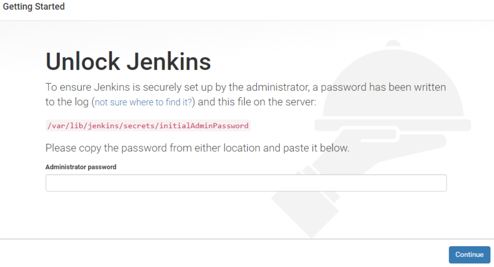

  Mithilfe des Unix-Befehls "cat" wurde die Datei, welche das Passwort
  enthält, geöffnet und das Passwort kopiert:<br>
  `
  sudo cat /var/lib/jenkins/secrets/initialAdminPassword
  `
2. Klicke auf " Install suggested plugins". Bei der Installation haben
wir bemerkt, dass kein Maven-Plugin installiert wurde (siehe 4.).

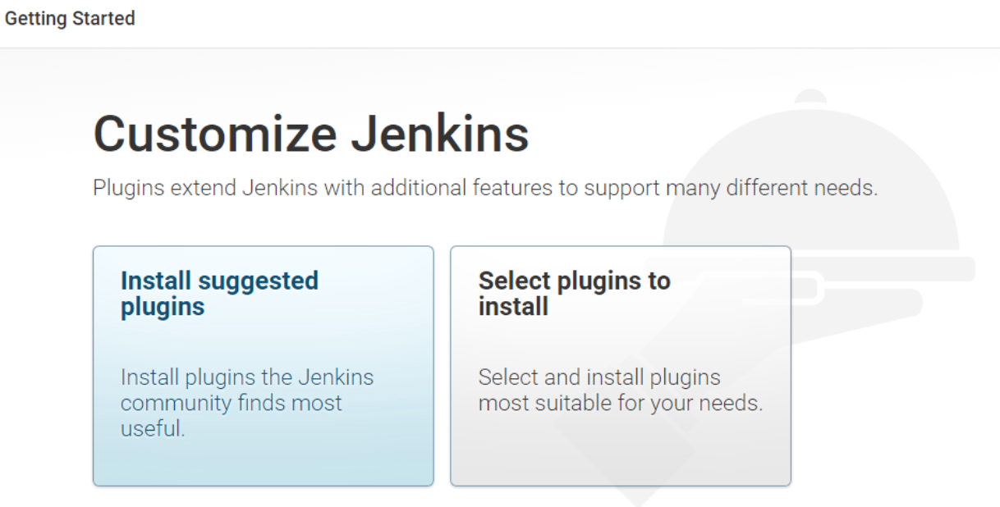

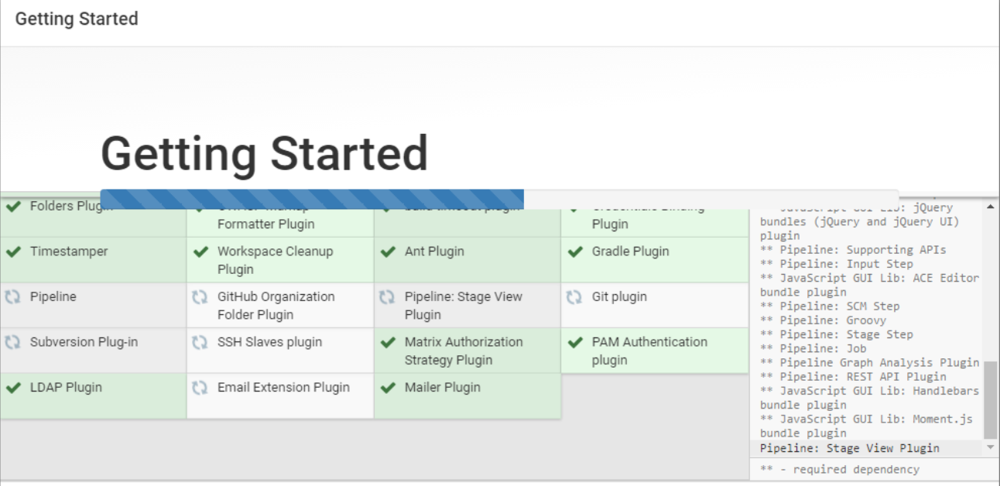

3. Erstelle den ersten Administrativen Nutzer

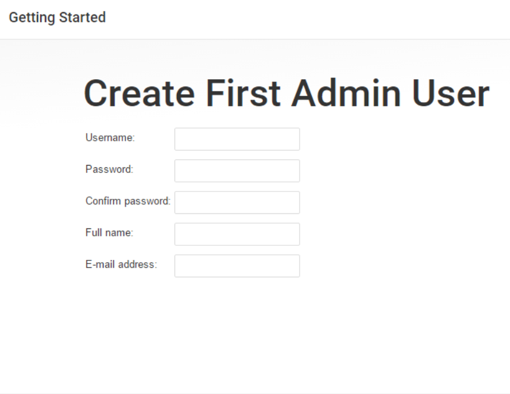

4. Weil Maven als Abhängigkeit gefehlt hat, wurde es manuell installiert.
Wir haben uns dazu entschieden, Maven auf dem Linux-Server zu installieren und
nicht direkt in Jenkins:<br>
`
sudo apt-get install maven
`

#### Repository einbinden
Im folgenden wird beschrieben, wie ein GitHub-Repository in Jenkins eingebunden
wird (Es wird vorausgesetzt, dass man in Jenkins eingeloggt ist):
1. Das Repository anlegen
<li>Klicke auf "Element anlegen" </li>

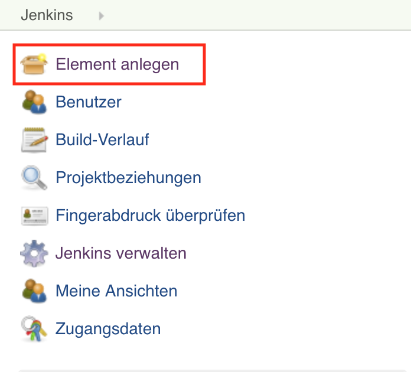

<li>Im Feld "Geben Sie einen Element-Namen an" muss ein Name eingefügt werden.
Wir verwendeten "repo-03". Im Anschluss wird "GitHub Organization" ausgewählt.


2. Falls es sich um ein privates Repository handelt, muss ein "Credential"
angelegt werden. Wird keiner angegeben, können nur öffentliche
Repositories gescannt werden. Dafür wird in der Kategorie
"Projects > GitHub Organization >Credentials" auf Add geklickt

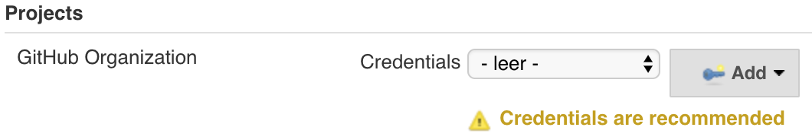

und das Formular ausgefüllt.

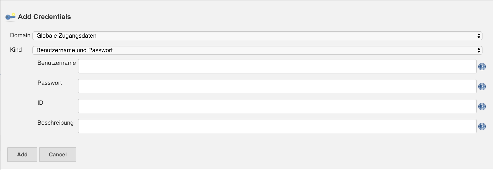
3. In der Kategorie "Projects > GitHub Organization > Owner" den Namen der
GitHub Organization oder des GitHub User Accounts angeben
(in unserem Fall "lsd-lecture").

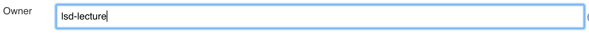

4. Damit das richtige Repository gefunden wird, muss der Repo-Name gefiltert
werden. In der Kategorie "Projects > GitHub Organization >
Behaviours" wird auf Add geklickt und "Filter by name (with wildcards)"
ausgewählt.

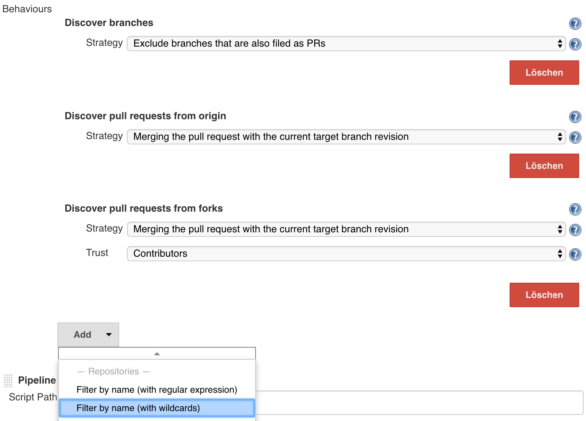

Bei dem Feld "Include" wird der Name des Repositories angegeben
(hier "repo-03").

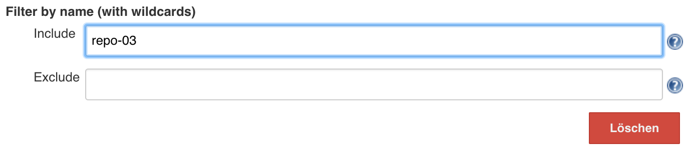

#### Tomcat zum ersten Mal builden
Im folgenden wird beschrieben, welche Schritte gemacht werden müssen, damit
Jenkins den Tomcat bauen kann
1. Im Repository eine Datei namens "Jenkinsfile" anlegen

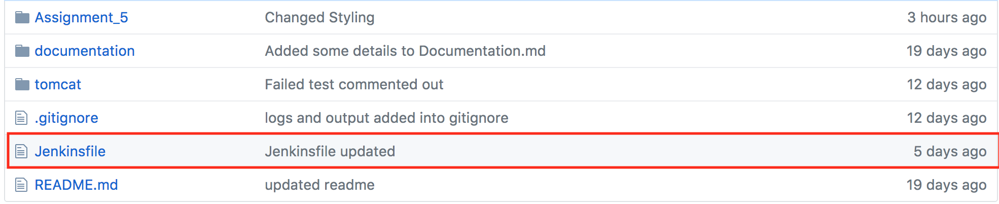

2. Anhand der Jenkins-Dokumentation (siehe https://jenkins.io/doc/book/pipeline/)
wurde die Struktur der Pipeline im Jenkinsfile angelegt. Im folgenden wird
das Resultat gezeigt:

```
pipeline {
    agent any
    stages {
        stage('Build') {
            steps {
                sh 'cd ./tomcat/apache-tomcat-6.0.53-src/ && mvn clean compile assembly:single'
                archiveArtifacts artifacts: '**/target/*jar-with-dependencies.jar', fingerprint: true
                echo 'Building..'
            }
        }
        stage('Test') {
            steps {
                sh 'cd ./tomcat/apache-tomcat-6.0.53-src/ && mvn test'
                echo 'Testing..'
            }
        }
        stage('Deploy') {
            steps {
                echo 'Deploying....'
                echo 'Just a test...'
            }
        }
    }
}
```

Die Pipeline ist in drei Teilen (Build, Test und Deploy) aufgebaut.
<li> Build: </li>
<li> Deploy: </li>
<li> Test: </li>

#### Trigger setzten
Es wurde versucht den Trigger zuerst mit Webhooks zu realisiseren, was
allerdings fehlgeschlagen ist, aber aufgrund der Gruendlichkeit, der Dokumentation,
trotzdem erwähnt wird. Die entgültige Lösung war es, einen Trigger in der
Pipeline hinzufügen.

###### Webhooks (Fehlschlag)
  1. Auf GitHub ins Repository gehen, dann auf "Settings > Webhooks > Add Webhook"

###### Trigger im Jenkinsfile hinzufügen

Tests splitten
