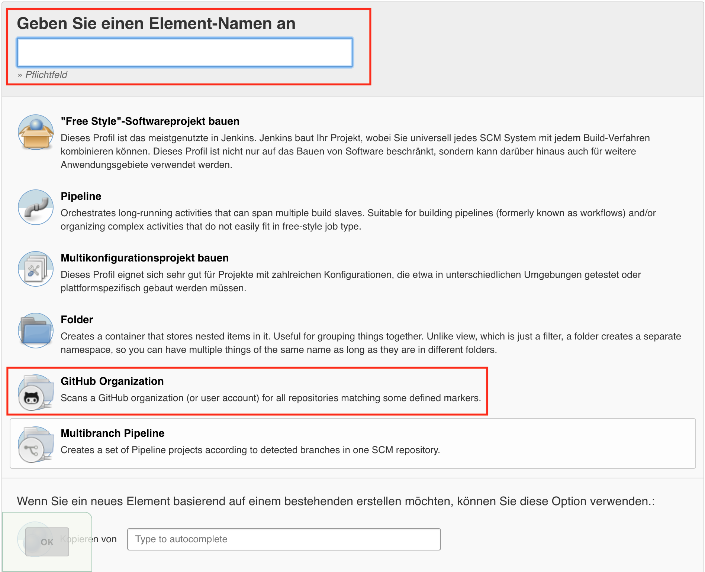

# Assignment 5
## Einleitung
Ziel des Assignments ist es, den auf Maven umgestellten Tomcat-Build mit Hilfe
des CI-Tools "Jenkins" zu automatisieren. Wie diese Aufgabe bearbeitet wurde, wird
im folgenden beschrieben.

## Ablauf
Zuallererst haben wir Jenkins auf dem Linux-Server installiert. Danach wurde eine
Jenkins-Pipeline angelegt, damit der Tomcat in Jenkins gebaut und
ausgefuehrt werden kann. Zum Schluss setzten wir einen Trigger, um zu
gewaehrleisten, dass bei jedem GitHub-Push der Tomcat gebuilded wird, ebenso
dass die Test ausgefuehrt werden und eine JAR-Datei abgelegt wird. Diese
Schritte werden im folgenden detailierter erlaeutert.

### Jenkins-Installation
Im folgenden werden die Arbeitsschritte zur Installation des CI-Tools "Jenkins"
auf dem Linux-Server beschrieben. Vorraussetzung ist, dass man sich bereits
als "root" auf dem Linux-Server angemeldet hat.
1. Den Publickey von Jenkins.io dem Server manuell hinzufuegen, damit diesen vertraut wird<br>
   ```
   sudo wget -q -O - https://pkg.jenkins.io/debian/jenkins-ci.org.key | sudo apt-key add -
   ```
2. Die Adresse der Paketquelle von Jenkins in die "source.list"-Datei
   des Linux-Servers hinzufuegen: <br>
   ```
   sudo echo deb https://pkg.jenkins.io/debian-stable binary/ | sudo tee /etc/apt/sources.list.d/jenkins.list
   ```

3. Update ausfuehren, damit die Paketquellen aktualisiert werden
   ```
   sudo apt-get update
   ```

4. Jenkins und seine Abhaengigkeiten installieren:<br>
   ```
   sudo apt-get install jenkins
   ```

5. In der Regel wird Jenkins nach der Installation automatisch gestartet. Falls
   nicht, kann dies mit dem folgenden Befehl gestartet werden<br>
   ```
   sudo systemctl start jenkins
   ```
   <br>Absofort ist Jenkins unter <i>http://SERVER-IP-ADRESSE:8080</i> erreichbar


### Jenkins-Konfiguration
Im folgenden wird beschrieben, wie Jenkins konfiguriert wird:
1. Jenkins unter der IP-Adresse <i>http://SERVER-IP-ADRESSE:8080</i> öffnen. Dort wird angezeigt, unter welchem Pfad das
   initial-Passwort liegt.

   

   Mithilfe des Unix-Befehls "cat" wurde die Dateiinhalt, welche das Passwort
   enthaelt angezeigt. Das ausgegebene Passwort muss manuell von Hand kopiert werden<br>
   ```
   sudo cat /var/lib/jenkins/secrets/initialAdminPassword
   ```

2. Klicke auf " Install suggested plugins". Bei der Installation haben
   wir bemerkt, dass kein Maven-Plugin installiert wurde (siehe 4.).

   

   

3. Erstelle den ersten Administrativen Nutzer

   

4. Weil Maven als Abhaengigkeit gefehlt hat, wurde es manuell installiert.
   Wir haben uns dazu entschieden, Maven auf dem Linux-Server zu installieren und
   nicht direkt in Jenkins:<br>
   ```
   sudo apt-get install maven
   ```

### Repository einbinden
Im folgenden wird beschrieben, wie ein GitHub-Repository in Jenkins eingebunden
wird (Es wird vorausgesetzt, dass man in Jenkins eingeloggt ist):
1. Das Repository anlegen
   <li>Klicke auf "Element anlegen" </li>

   

   <li>Im Feld "Geben Sie einen Element-Namen an" muss ein Name eingefuegt werden.
   Wir verwendeten "repo-03". Im Anschluss wird "GitHub Organization" ausgewaehlt.

   

2. Falls es sich um ein privates Repository handelt, muss ein "Credential"
   angelegt werden. Wird keiner angegeben, können nur öffentliche
   Repositories gescannt werden. Dafuer wird in der Kategorie
   "Projects > GitHub Organization >Credentials" auf Add geklickt und das Formular ausgefuellt.

   

   

3. In der Kategorie "Projects > GitHub Organization > Owner" den Namen der
   GitHub Organization oder des GitHub User Accounts angeben
   (in unserem Fall "lsd-lecture").

   

4. Wenn in Schritt 3 eine Organizationsname eingegeben wird, muss ein Filter erstellt werden. Dies ist notwendig, da sonst alle Repositories der Organization in Jenkins übernommen werden. In unserem Beispiel benoetigen wir nur "repo-03" und erstellen daher eine Filterung.
Um die Filterung zu aktivieren, in der Projekt Konfigutation auf "Projects > GitHub Organization >
   Behaviours" wechseln und dann auf Add klicken und "Filter by name (with wildcards)"
   auswaehlen.

   

  Bei dem Feld "Include" wird der Name des Repositories angegeben
  (hier "repo-03").

  

### Tomcat zum ersten Mal builden
Im folgenden wird beschrieben, welche Schritte gemacht werden muessen, damit
Jenkins den Tomcat bauen kann
1. Im Repository eine Datei namens "Jenkinsfile" anlegen

   

2. Anhand der Jenkins-Dokumentation (siehe https://jenkins.io/doc/book/pipeline/)
   wurde die Struktur der Pipeline im Jenkinsfile angelegt. Im folgenden wird
   das Resultat gezeigt:

   ```
   pipeline {
       agent any
       triggers {
         pollSCM('*/5 * * * *')
       }
       stages {
           stage('Build') {
               steps {
                   echo 'Building...'
                   sh 'cd ./tomcat/apache-tomcat-6.0.53-src/ && mvn clean compile assembly:single'
                   archiveArtifacts artifacts: '**/target/*jar-with-dependencies.jar', fingerprint: true
               }
           }
           stage('Test') {
               steps {
                   echo 'Testing..'
                   sh 'cd ./tomcat/apache-tomcat-6.0.53-src/ && mvn test'
               }
           }
           stage('Deploy') {
               steps {
                   echo 'Deploying...'
               }
           }
       }
   }
    ```

Die Pipeline ist in drei Teilen (Build, Test und Deploy) aufgebaut, welche beginnend
mit Build nacheinenander ausgeführt werden.
#### Build
In "Build" wird das Projekt gebaut und anschließend die erstellte .jar Datei in Jenkins archiviert. Dies kann dann in Jenkins heruntergeladen werden.
```
stage('Build') {
               steps {
                   echo 'Building...'
                   sh 'cd ./tomcat/apache-tomcat-6.0.53-src/ && mvn clean compile assembly:single'
                   archiveArtifacts artifacts: '**/target/*jar-with-dependencies.jar', fingerprint: true
               }
           }

```

#### Test
In Stage "Test" werden die Test ausgeführt

```
stage('Test') {
               steps {
                   echo 'Testing..'
                   sh 'cd ./tomcat/apache-tomcat-6.0.53-src/ && mvn test'
               }
           }
```

#### Deploy
In Stage "Deploy" ist es möglich die in "Build" erstellte .jar Datei zu starten. Somit hat man immer ein System der lauffähig und erreichbar ist. In unserem Repository ist der "Build" Stage definiert jedoch führt dies aktuell keine Deploy aus.
```
stage('Deploy') {
               steps {
                   echo 'Deploying...'
               }
           }
```


#### Trigger setzen
Es wurde versucht den Trigger zuerst mit Webhooks zu realisieren, was
allerdings fehlgeschlagen ist, aber aufgrund der Gruendlichkeit, der Dokumentation,
trotzdem erwaehnt wird. Die entgueltige Lösung war es, einen Trigger in der
Pipeline hinzufuegen.

##### Webhooks (Fehlschlag)
Es wurde versucht, dass bei einem Push auf das Repository, GitHub selbst
über einen Webhook Jenkins informiert, dass Änderungen vorgenommen wurden
und ein neuer Build ausgeführt werden kann.
Da wir aktuell diese Möglichkeit nicht testen können, können wir dafür auch keine genaue Anleitung geben. Jedoch ist es möglich, sich [hier](https://support.cloudbees.com/hc/en-us/articles/224543927-GitHub-webhook-configuration) zu informieren

##### Trigger im Jenkinsfile hinzufuegen
Weil die Webhook-Variante (GitHub benachrichtigt Jenkins) nicht funktioniert hat,
versuchten wir die Informationsrichtung umzudrehen, sprich Jenkins frägt bei
GitHub nach ob etwas neues vorhanden ist. Diese Variante wurde umgesetzt indem
wir einen Intervall im Jenkinsfile angelegt haben, der alle 5 Minuten beim
Repository nachfrägt, ob sich etwas verändert hat, wenn ja, dann wird ein
neuer Build ausgeführt.


```
pipeline {
    agent any
    triggers {
      pollSCM('*/5 * * * *')
    }
    ...
  }
```

Die Einstellung der Intervall ist wie in [Cron](https://wiki.ubuntuusers.de/Cron/#section2) möglich
```
-     -     -     -     -
|     |     |     |     |
|     |     |     |     +----- Wochentag (0 - 7) (Sonntag ist 0 und 7; oder Namen, siehe unten)
|     |     |     +------- Monat (1 - 12)
|     |     +--------- Tag (1 - 31)
|     +----------- Stunde (0 - 23)
+------------- Minute (0 - 59; oder Namen, siehe unten)
```

### Probleme
* Build automatisch ausführen, wenn im GitHub Repository eine Änderung(Push) stattfindet (Webhook)
   * Anstatt Webhook haben wir haben wir pollSCM genutzt. Dies überprüft in unserem Beispiel alle 5 Minuten, ob eine Änderung im Repository stattgefunden hat und führt entsprechend die Befehle aus
* Befehle zum ausführen der Build und Tests werden nicht ausgeführt
   * Nach erneuten lesen der Jenkins.io Dokumentation haben wir herausgefunden, dass Befehle die ausgeführt werden sollen, mit ```sh ''``` gekennzeichnet werden müssen. (siehe Jenkinsfile)
* mvn Befehle werden nicht ausgeführt
   * Maven (mvn) wurde bei der Installation von Jenkins nicht mit installiert. Deshalb musste dies nachinstalliert werden
   
