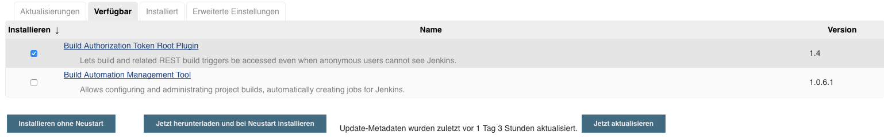

# Assignment 6
## Einleitung
Ziel des Assignments ist es, die CI-Pipeline im Jenkins so auszubauen, dass
die Tests-Plugins Emma, Findbugs und Checkstyle funktionieren.

## Ablauf
Zuallererst haben wir die Plugins auf dem Jenkins installiert und im
Anschluss wurden die Jenkinsfile bearbeitet, damit die Plugins richtig
funktionieren.

### Plugin-Installation
Im Folgenden werden die Arbeitsschritte zur Installation der Plugins auf dem
Jenkins beschrieben.
Unter ```Jenkins verwalten > Plugins verwalten > Verfügbar``` folgende
Plugins suchen:
  - Emma plugin
  - FindBugs Plug-in
  - Checkstyle Plug-in
  - HTML Publisher plugin (wird für Emma benötigt)
Bei allen Plugins muss in der Spalte "Aktiviert" ein Hacken gesetzt sein.
Im Anschluss wird auf "Installieren ohne Neustart" geklickt.



### Emma-Konfiguration
Im Folgenden wird beschrieben, wie Emma konfiguriert wird:
1. "emma:emma" dem Maven build hinzufügen, damit die Emma-Reports generiert
   werden
   ```
   sh 'cd ./tomcat/apache-tomcat-6.0.53-src/ && mvn emma:emma'
   ```

2. Damit die Reports als html angezeigt werden, wird das Plugin "HTML Publisher"
   benutzt. In der Jenkinsfile wurde folgendes hinzugefuegt:
   ```
   publishHTML target: [
     allowMissing: false,
     alwaysLinkToLastBuild: false,
     keepAll: true,
     reportDir: 'tomcat/apache-tomcat-6.0.53-src/target/site/emma',
     reportFiles: 'index.html',
     reportName: 'Emma Report',
   ]
   ```

3. Damit die Reports nur ausgegeben werden, wenn die Reports ergolgreich
   erstellt wurden, haben wir die Anweisung als Post-Action definiert. Das
   entgültige Resultat der Emma-Stage sieht wie folgt aus:
   ```
   stage('Emma') {
       steps {
           echo 'Emma...'
           sh 'cd ./tomcat/apache-tomcat-6.0.53-src/ && mvn emma:emma'
         }
           post {
             success {
               // publish html
               publishHTML target: [
                 allowMissing: false,
                 alwaysLinkToLastBuild: false,
                 keepAll: true,
                 reportDir: 'tomcat/apache-tomcat-6.0.53-src/target/site/emma',
                 reportFiles: 'index.html',
                 reportName: 'Emma Report',
               ]
             }
           }
   }
   ```

### FindBugs-Konfiguration
Im Folgenden wird beschrieben wie Findbugs konfiguriert wurde.
1. In der pom.xml wurde das Plugin im Reporting-Abschnitt hinzugefügt
   ```
   <reporting>
     <plugins>
       <plugin>
              <groupId>org.codehaus.mojo</groupId>
              <artifactId>findbugs-maven-plugin</artifactId>
              <version>2.5.2</version>
              <configuration>
                 <findbugsXmlOutput>true</findbugsXmlOutput>
                 <findbugsXmlWithMessages>true</findbugsXmlWithMessages>
                 <xmlOutput>true</xmlOutput>
              </configuration>
           </plugin>
     </plugins>
   </reporting>
   ```
2. "findbugs:findbugs" dem Maven build hinzufügen, damit die Findbugs-Reports
   generiert werden.
   ```
   sh 'cd ./tomcat/apache-tomcat-6.0.53-src/ && mvn findbugs:findbugs'
   ```
3. Damit Findbugs die generierten Reports visuell darstellt muss folgender
   Befehl ausgefuehrt werden:
   ```
   findbugs pattern: 'tomcat/apache-tomcat-6.0.53-src/target/findbugsXml.xml'
   ```
4. Damit die Reports nur ausgegeben werden, wenn die Reports ergolgreich
   erstellt wurden, haben wir die Anweisung als Post-Action definiert. Das
   entgültige Resultat der Findbugs-Stage sieht wie folgt aus:
   ```
   stage('Findbugs'){
       steps {
           echo 'Findbugs...'
           sh 'cd ./tomcat/apache-tomcat-6.0.53-src/ && mvn findbugs:findbugs'
       }
       post {
         success {
           findbugs pattern: 'tomcat/apache-tomcat-6.0.53-src/target/findbugsXml.xml'
         }
       }
   }
   ```

### Checkstyle-Konfiguration
Im Folgenden wird beschrieben, wie Checkstyle konfiguriert wird:
1. "checkstyle:checkstyle" dem Maven build hinzufügen, damit die
   Checkstyle-Reports generiert werden
   ```
   sh 'cd ./tomcat/apache-tomcat-6.0.53-src/ && mvn checkstyle:checkstyle'
   ```

2. Damit Checkstyle die generierten Reports visuell darstellt muss folgender
   Befehl ausgefuehrt werden:
   ```
   checkstyle pattern: 'tomcat/apache-tomcat-6.0.53-src/target/checkstyle-result.xml'
   ```

3. Damit die Reports nur ausgegeben werden, wenn die Reports ergolgreich
   erstellt wurden, haben wir die Anweisung als Post-Action definiert. Das
   entgültige Resultat der Checkstyle-Stage sieht wie folgt aus:
   ```
   stage('Checkstyle'){
       steps {
           echo 'Checkstyle...'
           sh 'cd ./tomcat/apache-tomcat-6.0.53-src/ && mvn checkstyle:checkstyle'
       }
       post {
         success {
           checkstyle pattern: 'tomcat/apache-tomcat-6.0.53-src/target/checkstyle-result.xml'
         }
       }
   }
   ```

### Probleme
- Die "Declarative Pipeline" wurde Anfang dieses Jahres in Jenkins hinzugefügt,
  weshalb es dazu wenig Dokumentation gibt. Es war ein Problem, weil nicht klar
  gewesen ist, wie manche befehle in der Pipeline auszusehen haben.
- Das ständige Warten bis ein Build fertig ist, erschwert einem die Umsetzung.
