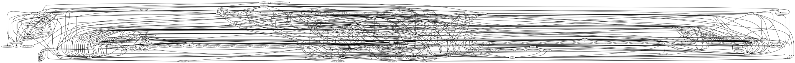
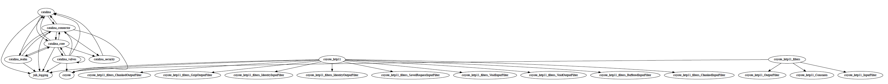
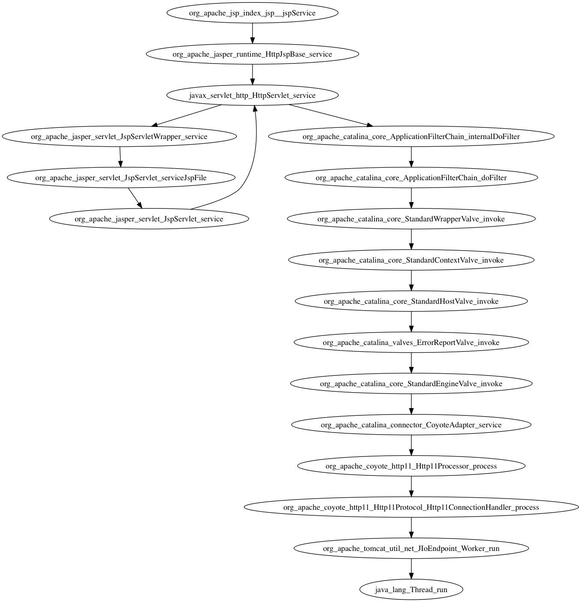
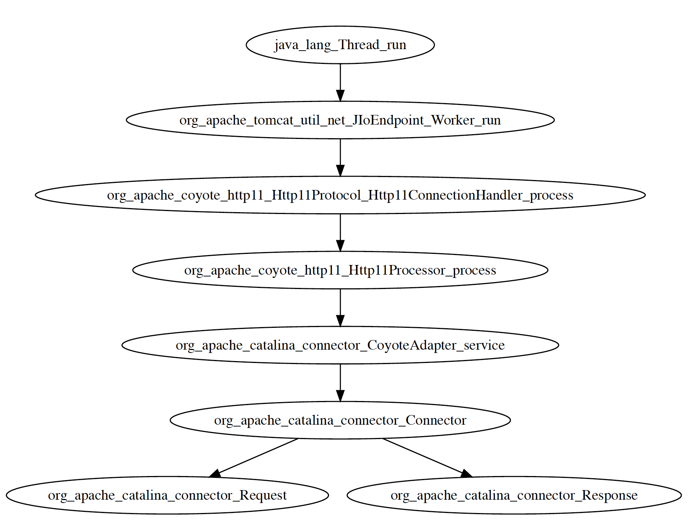

<b>Autoren:</b> Inan Bayram, Mustafa Yildiz, Patrick Domscheid</br>
<b>Stand</b>: 24.10.17</br>
<hr>
<h1>Einleitung</h1>
Im Rahmen der LSD(Large Scale Development)-Vorlesung mussten wir
die Architektur des Tomcat 6.0.53 untersuchen. Die Analyse der
Architektur wurde auf die Request-Abfrage beschränkt, damit der
zeitliche Rahmen der Vorlesung nicht gesprengt wird.

<hr>

<h1>Vorgehen</h1>
Um die Architektur des Request-Ablaufs zu ergründen wurde mit einer
statischen Analyse begonnen. Danach bearbeiteten wir anhand der Resulate
die dynamischen Analyse.

<h2>Statische Analyse</h2>
Die statische Analyse wurde mit folgenden Schritten erarbeitet:</br>
<b>1.</b> Mithilfe des Linux-Tools "grep" wurden alle import-Anweisungen aus den
Dateien, in dem Verzeichnis "java.org.apache", herausgefiltert.



<b>2.</b> Mit dem Linux-Tool "sed" wurden die Resultate bearbeitet, damit diese
menschenlesbar ausgegeben werden und direkt erkannt wird, welches Paket auf
ein anderes Paket zugreift. Dafür haben wir folgendes Format verwendet:
Quellpaket -> Zielpaket (Quellpaket importiert Zielpaket).
<b>3.</b> Mithilfe des Debuggers haben wir herauskristalisisert, welche Pakete für den
Request-Ablauf relevant sind.
<b>4.</b> Das Linux-Tool "grep" wurde verwendet, um alle unrelevanten Pakete
herauszufiltern (siehe folgende Codezeilen).

```grep -v "el_*" | grep -v "jasper_*" | grep -v "jk_*" | grep -v "naming_*" |
grep -v "tomcat_*" | grep -v "catalina_ant*" | grep -v "catalina_authenticator*" |
grep -v "catalina_deploy*" | grep -v "catalina_filters*" |
grep -v "catalina_ha_*" | grep -v "catalina_loader*" | grep -v "catalina_manager*" |
grep -v "catalina_mbeans*" | grep -v "catalina_realmÜ" |
grep -v "catalina_servlets*" | grep -v "catalina_session*" | grep -v "catalina_ssi*" |
grep -v "catalina_startup*" | grep -v "catalina_tribes*" |
grep -v "catalina_users*" | grep -v "catalina_util*" |
grep -v "coyote_memory" | grep -v "coyote_ajp" |
grep -v "org_*" |
```
5. Mithilfe dem Tool "vizgraph" wurde ein PDF-Dokument erstellt, welches
die Abhängigkeiten zwischen den Paketen angibt.



</br>

<h2>Dynamische Analyse</h2>
Anhand der statischen Analyse fanden wir heraus, dass die catalina_connector-Klasse
als Schnittstelle für den Request-Ablauf dient. Deshalb haben wir dort den Debugger
erneut angesetzt um den Ablauf zu verstehen. Dabei haben wir die Request-Klasse entdeckt,
in der wir eine Exception geworfen haben, um die Klassenhierarchie (StackTrace) herauszufinden.</br>

```
try{
    throw new Exception();
} catch(Exception e){
    e.printStackTrace();
}
```

```
java.lang.Exception
	at org.apache.catalina.connector.Request.setConnector(Request.java:533)
	at org.apache.catalina.connector.Connector.createRequest(Connector.java:1017)
	at org.apache.catalina.connector.CoyoteAdapter.service(CoyoteAdapter.java:261)
	at org.apache.coyote.http11.Http11Processor.process(Http11Processor.java:859)
	at org.apache.coyote.http11.Http11Protocol$Http11ConnectionHandler.process(Http11Protocol.java:610)
	at org.apache.tomcat.util.net.JIoEndpoint$Worker.run(JIoEndpoint.java:503)
	at java.lang.Thread.run(Thread.java:748)
```
Diese wurde bei "java.lang.Thread" gestoppt, weshalb wird dort erneut eine Exception
geworfen haben.</br>

```
java.lang.Exception
at org.apache.jsp.index_jsp._jspService(index_jsp.java:75)
at org.apache.jasper.runtime.HttpJspBase.service(HttpJspBase.java:70)
at javax.servlet.http.HttpServlet.service(HttpServlet.java:723)
at org.apache.jasper.servlet.JspServletWrapper.service(JspServletWrapper.java:388)
at org.apache.jasper.servlet.JspServlet.serviceJspFile(JspServlet.java:321)
at org.apache.jasper.servlet.JspServlet.service(JspServlet.java:267)
at javax.servlet.http.HttpServlet.service(HttpServlet.java:723)
at org.apache.catalina.core.ApplicationFilterChain.internalDoFilter(ApplicationFilterChain.java:290)
at org.apache.catalina.core.ApplicationFilterChain.doFilter(ApplicationFilterChain.java:206)
at org.apache.catalina.core.StandardWrapperValve.invoke(StandardWrapperValve.java:233)
at org.apache.catalina.core.StandardContextValve.invoke(StandardContextValve.java:191)
at org.apache.catalina.core.StandardHostValve.invoke(StandardHostValve.java:127)
at org.apache.catalina.valves.ErrorReportValve.invoke(ErrorReportValve.java:103)
at org.apache.catalina.core.StandardEngineValve.invoke(StandardEngineValve.java:109)
at org.apache.catalina.connector.CoyoteAdapter.service(CoyoteAdapter.java:293)
at org.apache.coyote.http11.Http11Processor.process(Http11Processor.java:859)
at org.apache.coyote.http11.Http11Protocol$Http11ConnectionHandler.process(Http11Protocol.java:610)
at org.apache.tomcat.util.net.JIoEndpoint$Worker.run(JIoEndpoint.java:503)
at java.lang.Thread.run(Thread.java:745)
```

<h1>Ergebniss der Analyse</h1>
Der Request-Ablauf ist in zwei Kategorien unterteilt:</br>
<b>1.</b> Der Request-Ablauf (erste folgende Abbildung)</br>
<b>2.</b> Der Request-Thread-Ablauf (zweite folgende Abbildung)</br>





<h1>Probleme</h1>
Während der Bearbeitung, der Aufgabe, sind uns folgende Probleme aufgefallen:</br>
<b>1.</b> Zu Beginn waren die Diagramme von dem Tool "Graphviz" sehr unübersichtlich
und die Pakete, die nicht relevant gewesen sind, haben nicht herausgestochen.</br>
<b>2.</b> Das Tool "Graphviz" hat ein Diagramm nicht zusammenhängend gezeichnet,
obwohl die Syntax stimmte
